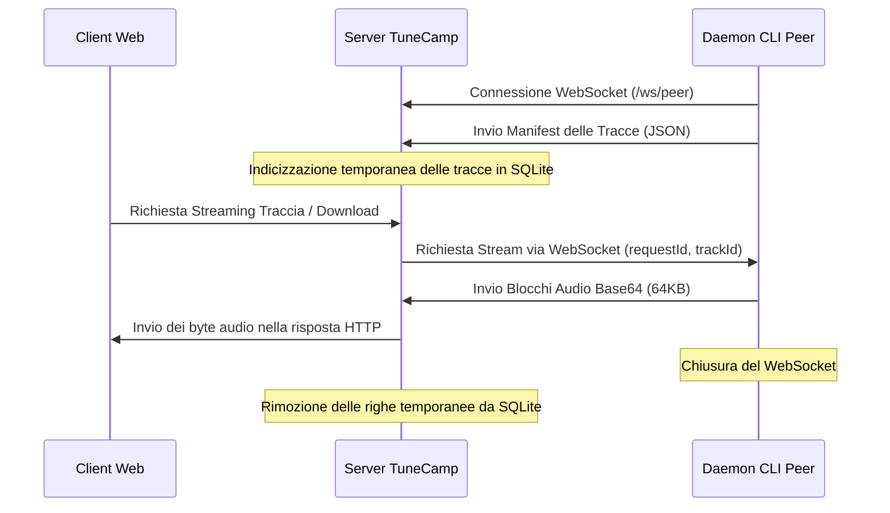

# Condivisione Peer-to-Peer (Sidecamp)

TuneCamp Sidecamp è una funzionalità integrata, ispirata al modello P2P, che consente agli utenti abilitati di condividere le proprie cartelle musicali locali con un'istanza TuneCamp in tempo reale. I brani condivisi sono temporanei e vengono serviti su richiesta tramite un tunnel WebSocket inverso, superando sistemi NAT e firewall senza richiedere il port-forwarding manuale o la configurazione del router.

---

## Panoramica dell'Architettura



1. **Connessione WebSocket di Controllo**: Il daemon del peer si connette a `/ws/peer` utilizzando un token di autenticazione JWT.
2. **Catalogazione Temporanea**: Il daemon scansiona le cartelle condivise e invia un manifest con i metadati. Il server indicizza queste tracce nel database SQLite.
3. **Tunneling su Richiesta (On-Demand)**: Quando un ascoltatore riproduce una traccia condivisa, il server la richiede al daemon tramite la connessione WebSocket. Il daemon legge il file in blocchi da 64KB, li codifica in base64 e li invia al server. Il server decodifica i blocchi e li convoglia direttamente nella risposta HTTP di Express.
4. **Rimozione Immediata**: Se il daemon viene arrestato o si disconnette, il ping di controllo (inviato ogni 30 secondi) fallisce o l'evento di disconnessione avvia la procedura di pulizia, eliminando immediatamente le tracce del peer e la sua sessione dal database.

---

## Configurazione per Amministratori

Gli amministratori possono controllare la condivisione peer tramite il **Pannello di Amministrazione**:

1. **Controlli Globali** (nella sezione **Settings → Customize Modules**):
   - **Enable Sidecamp**: Abilita o disabilita la funzionalità a livello globale.
   - **Allow Peer Downloads**: Consente agli ascoltatori di scaricare i brani condivisi (se disabilitato, è consentito solo lo streaming).
2. **Permessi Utente** (nella sezione **Users**):
   - Abilita o disabilita la **Condivisione Peer** per i singoli utenti. Solo gli utenti con questo flag attivo possono stabilire una connessione WebSocket usando il daemon.
3. **Pannello delle Sessioni Attive** (nella sezione **Peer Sessions**):
   - Elenco in tempo reale di tutti i daemon connessi, con indicazione dell'account utente, ora di connessione, ultimo segnale di attività (heartbeat), indirizzo IP e numero totale di tracce condivise.
   - Consente agli amministratori di disconnettere o espellere (kick) manualmente qualsiasi sessione del daemon attiva.

### Importare una Traccia Peer nella Libreria

Oltre allo streaming e al download occasionale, i **Root Admin e i Manager** possono **importare** in modo permanente una traccia peer condivisa nella libreria locale. Il pulsante di importazione (accanto al download su ogni traccia peer) scarica il file completo attraverso il tunnel, lo salva in `<musicDir>/peer-imports/` e lo passa allo scanner affinché diventi una normale release locale, che sopravvive anche dopo la disconnessione del peer.

L'importazione richiede che i download siano consentiti (a livello globale, per la sessione e per la traccia), poiché trasferisce il file completo. L'azione è esposta su `POST /api/peers/:sessionId/tracks/:trackId/import` ed è riservata ai ruoli Root Admin / Manager.

### Federare le Tracce Peer tra le Istanze

Quando l'opzione **Federate Peer Tracks** è attiva (Settings → Customize Modules, disattivata di default), un'istanza pubblicizza le proprie tracce peer **attualmente condivise** alle altre istanze TuneCamp federate, insieme alle release pubblicate. Questo riusa il percorso di federazione esistente:

- Le tracce vengono aggiunte al payload `GET /api/catalog/full` dell'istanza in un array `peerTracks` (solo quando sono attive sia **Enable Sidecamp** sia **Federate Peer Tracks**).
- Le istanze remote le acquisiscono tramite la stessa cache del catalogo usata per le release e le mostrano nella pagina **Network** (`type: "peer"`).
- La riproduzione passa da un endpoint **pubblico** dedicato, `GET /api/peers/:sessionId/tracks/:trackId/federated-stream`, raggiungibile senza un account locale ma **solo** finché la federazione peer è abilitata.
- Nella pagina Network le tracce peer federate hanno un badge distinto **PEER** per distinguerle dalle release permanenti.

**Import tra istanze.** Se l'istanza di origine consente anche i download peer, le tracce peer federate vengono pubblicizzate con un URL `federated-download`. Un **Root Admin / Manager** su un'istanza remota può quindi importare la traccia nella propria libreria tramite il pulsante **import** nella pagina Network (oppure `POST /api/peers/federated-import` con il `downloadUrl`). L'istanza remota scarica il file via HTTP (protetto da SSRF, con limite di dimensione), lo salva in `<musicDir>/peer-imports/` e lo indicizza come un normale upload locale. Quando l'origine tiene i download disabilitati, viene offerto solo lo streaming.

Queste voci sono effimere: esistono solo finché il daemon peer è connesso. Poiché un catalogo che pubblicizza tracce peer viene rivalidato su una finestra breve (~2 minuti, contro ~1 ora per i cataloghi di sole release), un peer disconnesso scompare dalle pagine Network remote entro un paio di minuti; tentare di riprodurre una traccia ormai offline restituisce semplicemente un errore.

**Ricerca tra istanze.** Oltre al piggyback passivo del catalogo qui sopra, la **ricerca globale** di un utente autenticato fa attivamente fan-out verso le istanze federate note (limite 10, in parallelo, timeout 3s, protetta da SSRF) e unisce le tracce corrispondenti dei loro peer connessi, ognuna taggata con il proprio `origin`. È esposta pubblicamente come `GET /api/peers/federated-search?q=...`, protetta dallo stesso opt-in **Federate Peer Tracks** di `federated-stream`, ed è a **singolo hop** — l'istanza A non fa da proxy alla federazione dell'istanza B. Gli hit remoti si riproducono dall'endpoint pubblico `federated-stream` dell'istanza di origine; solo ricerca e streaming, nessun download.

---

## Esecuzione di Sidecamp

L'applicazione Sidecamp è un **pacchetto desktop autonomo** ospitato in un repository separato: [`sidecamp`](https://github.com/scobru/sidecamp).

### Installazione

Scarica l'ultimo installer `.exe` dal repository o compilalo dai sorgenti:

```bash
git clone https://github.com/scobru/sidecamp.git
cd sidecamp
npm install
npm run build
```

### Utilizzo

1. Apri Sidecamp sul tuo computer.
2. Nella scheda **Impostazioni**, inserisci l'URL del tuo Host TuneCamp (es. `https://tuo-dominio-tunecamp.com`) e il tuo token di autenticazione (JWT).
3. Nella **Dashboard di Condivisione**, seleziona le cartelle locali che desideri condividere.
4. Attiva le connessioni a Soulseek o Torrents. I brani scaricati verranno automaticamente indicizzati dal daemon e condivisi nuovamente col tuo server.

