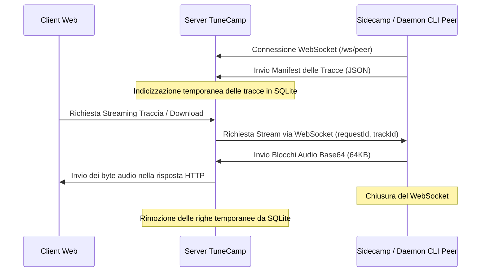

# TuneCamp Sidecamp

**Sidecamp** è un monorepo npm-workspaces che ospita l'ecosistema desktop companion di TuneCamp. Gestisce tutta l'acquisizione di contenuti P2P e la condivisione peer di file — mantenendo il server core pulito e pienamente conforme.

```
apps/sidecamp        # App desktop Electron companion
apps/graphofone      # App autonoma per performance live (no P2P, no server)
apps/sidecamp-cli    # Client CLI headless (no Electron): ricerca/download/upload/daemon peer
packages/audio-engine # DSP Web Audio puro: crossfade player, time-warp, worklet
packages/graph-ui     # React graph view: track graph, transizioni, waveform, registrazione
```

Dipendenza condivisa: `tunecamp-design-system` — selettore a 5 temi (dark/light/grey/nordic/nordic-dark), usato da Sidecamp e Graphofone via npm `file:`/`github:`.

---

## App

### Sidecamp (Electron)

Il principale companion desktop. Si connette a un'istanza TuneCamp via WebSocket ed espone una moderna interfaccia React per:

- 🔎 **Ricerca Unificata** — Soulseek, SoundCloud, Bandcamp, torrent, Internet Archive e la rete peer TuneCamp da una sola barra.
- 🧲 **BitTorrent / WebTorrent** — Aggiungi link magnet o file torrent; scarica e condividi dal desktop.
- 🎬 **Ripping Audio con yt-dlp** — Estrai audio da YouTube, SoundCloud, Bandcamp e altre piattaforme.
- 🌐 **Network Explorer** — Naviga le tracce condivise dai peer TuneCamp e il catalogo del server.
- 🎵 **Libreria Locale** — Sfoglia i file scaricati con player integrato; modifica i tag ID3; rinomina i file.
- 📂 **Browser File Condivisi** — Naviga, crea sottocartelle, sposta o elimina file nelle cartelle condivise.
- 💬 **Chat Peer** — Messaggi diretti ad altri peer, cifrati end-to-end (Curve25519/XSalsa20-Poly1305 via `tweetnacl`). Il server relay non vede mai il testo in chiaro dei DM. La stessa lobby `ChatService` è condivisa anche con le tab del browser che si connettono via `/ws/chat`.
- 📁 **Condivisione File Peer** — Condividi cartelle musicali locali tramite un tunnel WebSocket inverso sicuro (`/ws/peer`). Gli ascoltatori possono fare streaming o scaricare file inoltrati dal server.
- 📤 **Upload su TuneCamp** — Invia tracce dalla libreria locale al tuo account TuneCamp.
- 🖥️ **GUI Desktop** — React + Vite dentro Electron, 5 temi via `tunecamp-design-system`.

### Graphofone (Electron)

Uno strumento focalizzato per **performance live** — completamente offline, niente P2P, niente server. Importa una cartella musicale, disponi le tracce come un grafo, collegale con transizioni crossfade in sincronia al BPM ed esegui. Include un tour introduttivo al primo avvio (riapribile dal pulsante `?`). Il motore grafico/mixing (`packages/graph-ui`, `packages/audio-engine`) è solo in Graphofone; Sidecamp rimane un player snello con playlist classiche.

### Sidecamp CLI

Client terminale headless per le stesse funzionalità senza Electron — per server, macchine headless o scripting. Autenticazione via `sidecamp login` (salva il JWT in `~/.config/sidecamp-cli/config.json` su Linux/macOS o `%APPDATA%/sidecamp-cli/config.json` su Windows).

**Comandi:**

| Comando | Descrizione |
|---|---|
| `sidecamp login <server> <username> <password>` | Autentica e salva il JWT localmente |
| `sidecamp library [query]` / `catalog` | Visualizza o cerca nel catalogo dell'istanza |
| `sidecamp download-track <trackId>` | Scarica una traccia dalla libreria dell'istanza |
| `sidecamp search -s <source> <query>` | Cerca su una sorgente: `youtube` (default), `soundcloud`, `bandcamp`, `archive`, `torrent`, `soulseek`, `library` |
| `sidecamp get -s <source> <query>` | Cerca e scarica automaticamente il primo risultato |
| `sidecamp upload <filePath>` | Carica un file locale sul tuo account TuneCamp |
| `sidecamp share [-f <cartelle...>] [--no-downloads]` | Avvia il daemon P2P headless |
| `sidecamp peers` | Elenca i peer connessi alla tua istanza |
| `sidecamp peer-tracks <sessionId>` | Elenca le tracce condivise da un peer connesso |
| `sidecamp download-peer-track <sessionId> <trackId>` | Scarica una traccia da un peer |
| `sidecamp community` | Elenca i siti community federati |
| `sidecamp federated-catalog <origin>` | Visualizza il catalogo pubblico di un'istanza remota |
| `sidecamp download-federated-track <origin> <trackId>` | Scarica una traccia federata |
| `sidecamp downloads` | Elenca i file nella cartella di download locale |

Installazione globale dalla cartella `apps/sidecamp-cli/`:
```bash
npm install -g .
```

Riferimento completo: [`apps/sidecamp-cli/README.md`](https://github.com/scobru/sidecamp/tree/main/apps/sidecamp-cli).

---

## Panoramica dell'Architettura


```mermaid
sequenceDiagram
    participant Browser as Client Web
    participant Server as Server TuneCamp
    participant Daemon as Sidecamp / Daemon CLI Peer
    
    Daemon->>Server: Connessione WebSocket (/ws/peer)
    Daemon->>Server: Invio Manifest delle Tracce (JSON)
    Note over Server: Indicizzazione temporanea delle tracce in SQLite
    
    Browser->>Server: Richiesta Streaming Traccia / Download
    Server->>Daemon: Richiesta Stream via WebSocket (requestId, trackId)
    Daemon->>Server: Invio Blocchi Audio Base64 (64KB)
    Server->>Browser: Invio dei byte audio nella risposta HTTP
    
    Note over Daemon: Chiusura del WebSocket
    Note over Server: Rimozione delle righe temporanee da SQLite
```

1. **Connessione WebSocket di Controllo**: Il daemon del peer si connette a `/ws/peer` utilizzando un token JWT.
2. **Catalogazione Temporanea**: Il daemon scansiona le cartelle condivise e invia un manifest con i metadati. Il server indicizza queste tracce in SQLite.
3. **Tunneling su Richiesta**: Quando un ascoltatore riproduce una traccia condivisa, il server la richiede al daemon tramite WebSocket. Il daemon legge il file in blocchi da 64KB, li codifica in base64 e li invia. Il server decodifica i blocchi e li convoglia nella risposta HTTP di Express.
4. **Rimozione Immediata**: Se il daemon si disconnette, il ping di controllo (ogni 30 secondi) fallisce o l'evento di disconnessione avvia la pulizia, eliminando immediatamente le tracce e la sessione dal database.

---

## Configurazione per Amministratori

Gli amministratori possono controllare la condivisione peer tramite il **Pannello di Amministrazione**:

1. **Controlli Globali** (nella sezione **Settings → Customize Modules**):
   - **Enable Sidecamp**: Abilita o disabilita la funzionalità a livello globale.
   - **Allow Peer Downloads**: Consente agli ascoltatori di scaricare i brani condivisi (se disabilitato, è consentito solo lo streaming).
2. **Permessi Utente** (nella sezione **Users**):
   - Abilita o disabilita la **Condivisione Peer** per i singoli utenti. Solo gli utenti con questo flag attivo possono stabilire una connessione WebSocket usando il daemon.
3. **Pannello delle Sessioni Attive** (nella sezione **Peer Sessions**):
   - Elenco in tempo reale di tutti i daemon connessi, con account utente, ora di connessione, ultimo heartbeat, indirizzo IP e tracce totali condivise.
   - Consente di disconnettere o espellere manualmente qualsiasi sessione daemon attiva.

### Importare una Traccia Peer nella Libreria

Oltre allo streaming e al download occasionale, i **Root Admin e i Manager** possono **importare** in modo permanente una traccia peer condivisa nella libreria locale. Il pulsante di importazione scarica il file completo attraverso il tunnel, lo salva in `<musicDir>/peer-imports/` e lo passa allo scanner affinché diventi una normale release locale, sopravvivendo alla disconnessione del peer.

L'importazione richiede che i download siano consentiti (a livello globale, per la sessione e per la traccia). L'azione è esposta su `POST /api/peers/:sessionId/tracks/:trackId/import` ed è riservata ai ruoli Root Admin / Manager.

### Federare le Tracce Peer tra le Istanze

Quando l'opzione **Federate Peer Tracks** è attiva (Settings → Customize Modules, disattivata di default), un'istanza pubblicizza le proprie tracce peer **attualmente condivise** alle altre istanze TuneCamp federate, insieme alle release pubblicate. Questo riusa il percorso di federazione esistente:

- Le tracce vengono aggiunte al payload `GET /api/catalog/full` dell'istanza in un array `peerTracks` (solo quando sono attive sia **Enable Sidecamp** sia **Federate Peer Tracks**).
- Le istanze remote le acquisiscono tramite la stessa cache del catalogo usata per le release e le mostrano nella pagina **Network** (`type: "peer"`).
- La riproduzione passa da un endpoint **pubblico** dedicato, `GET /api/peers/:sessionId/tracks/:trackId/federated-stream`, raggiungibile senza un account locale ma **solo** finché la federazione peer è abilitata.
- Nella pagina Network le tracce peer federate hanno un badge distinto **PEER** per distinguerle dalle release permanenti.

**Import tra istanze.** Se l'istanza di origine consente anche i download peer, le tracce peer federate vengono pubblicizzate con un URL `federated-download`. Un **Root Admin / Manager** su un'istanza remota può quindi importare la traccia nella propria libreria tramite il pulsante **import** nella pagina Network (o `POST /api/peers/federated-import` con il `downloadUrl`). L'istanza remota scarica il file via HTTP (protetto da SSRF, con limite di dimensione), lo salva in `<musicDir>/peer-imports/` e lo indicizza come un normale upload locale. Quando l'origine tiene i download disabilitati, viene offerto solo lo streaming.

Queste voci sono effimere: esistono solo finché il daemon peer è connesso. Un catalogo che pubblicizza tracce peer viene rivalidato su una finestra breve (~2 minuti, contro ~1 ora per i cataloghi di sole release); un peer disconnesso scompare dalle pagine Network remote entro pochi minuti.

**Ricerca tra istanze.** La **ricerca globale** di un utente autenticato fa fan-out verso le istanze federate note (limite 10, in parallelo, timeout 3s, protetta da SSRF) e unisce le tracce corrispondenti dei loro peer connessi, ognuna taggata con il proprio `origin`. È esposta come `GET /api/peers/federated-search?q=...`, protetta dallo stesso opt-in **Federate Peer Tracks**, a **singolo hop** — l'istanza A non fa da proxy alla federazione dell'istanza B.

---

## Installazione e Build

### Prerequisiti

- **Node.js** 18+ e **npm**
- **yt-dlp** — scaricato automaticamente al primo utilizzo (nessuna installazione manuale)
- Un'istanza **TuneCamp** attiva (solo per Sidecamp e CLI; Graphofone è completamente offline)

### Sviluppo

```bash
git clone https://github.com/scobru/sidecamp.git
cd sidecamp
npm install

# Avvio in modalità sviluppo (Vite + Electron)
npm run dev --workspace apps/sidecamp
npm run dev --workspace apps/graphofone
```

### Build di Produzione

```bash
# Dalla root del repo — compila tutte le app per l'OS corrente
npm run build

# Oppure una singola app
npm run build --workspace apps/graphofone
```

Script per piattaforma (da dentro `apps/sidecamp` o `apps/graphofone`):

```bash
npm run build:win     # Installer NSIS (.exe)
npm run build:mac     # DMG (.dmg) + ZIP (.zip)  — solo host macOS
npm run build:linux   # AppImage (.AppImage) + Debian (.deb)
```

> **Non è possibile compilare l'installer macOS su Windows o Linux** — richiede gli strumenti Apple. Usa la CI per produrre tutte e tre le piattaforme contemporaneamente.

### CI Cross-Platform

`.github/workflows/release.yml` compila **sia Sidecamp che Graphofone** su runner Windows, macOS e Linux in parallelo. Crea un tag di versione per pubblicare una GitHub Release con tutti gli installer allegati:

```bash
git tag v0.1.0 && git push origin v0.1.0
```

Oppure avvia manualmente il workflow (`workflow_dispatch`) per compilare e caricare gli artefatti. Le build CI non sono firmate (nessun certificato di firma configurato).

---

## Connessione a TuneCamp (Electron)

1. Apri Sidecamp e vai su **Impostazioni**.
2. Inserisci l'URL della tua istanza TuneCamp (es. `https://il-tuo-server.com`).
3. Incolla il tuo token JWT (ottenibile dal pannello admin di TuneCamp o dall'API).
4. Seleziona le cartelle locali che vuoi condividere.
5. Clicca **Connetti** — Sidecamp stabilisce un tunnel WebSocket inverso verso il server.
