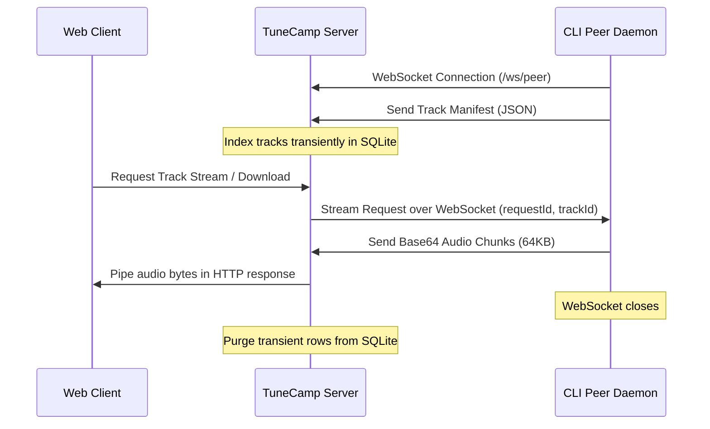

# TuneCamp Sidecamp

TuneCamp Sidecamp is a built-in, P2P-inspired capability allowing users with designated permissions to share their local music folders with a TuneCamp instance in real-time. Shared tracks are transient and served on-demand via a reverse WebSocket tunnel, bypassing NATs and firewalls without requiring manual port-forwarding or router configurations.

---

## Architecture Overview



1. **Control WebSocket Connection**: The peer daemon connects to `/ws/peer` using a JWT authentication token.
2. **Transient Cataloging**: The daemon scans the shared folders and uploads a metadata manifest. The server indexes these tracks in SQLite.
3. **On-Demand Tunneling**: When a listener plays a peer track, the server requests the track from the daemon over WebSocket. The daemon reads the file in 64KB chunks, encodes them in base64, and pushes them back. The server decodes the chunks and pipes them directly to the Express HTTP response stream.
4. **Instant Cleanup**: If the daemon shuts down or disconnects, the heartbeat ping (every 30 seconds) fails or the connection event triggers cleanup, immediately removing the peer's tracks and session from the database.

---

## Admin Configuration

Administrators can control peer sharing via the **Admin Panel**:

1. **Global Toggles** (under **Settings → Customize Modules**):
   - **Enable Sidecamp**: Turns the feature on or off globally.
   - **Allow Peer Downloads**: Allows listeners to download shared tracks (when disabled, only streaming is permitted).
2. **User Permissions** (under **Users**):
   - Toggle **Sidecamp** for individual users. Only users with this flag enabled can establish a WebSocket connection using the daemon.
3. **Active Dashboard** (under **Peer Sessions**):
   - Real-time list of all connected daemons, showing the user account, connection time, last heartbeat, IP address, and total shared tracks.
   - Allows administrators to manually disconnect/kick any active daemon session.

### Importing a Peer Track into the Library

Beyond streaming and one-off downloads, **Root Admins and Managers** can permanently **import** a shared peer track into the local library. The import button (next to download on each peer track) pulls the full file over the tunnel, writes it under `<musicDir>/peer-imports/`, and runs it through the scanner so it becomes a regular local release — surviving after the peer disconnects.

Importing requires downloads to be allowed (globally, for the session, and for the track), since it transfers the full file. The action is exposed at `POST /api/peers/:sessionId/tracks/:trackId/import` and is restricted to Root Admin / Manager roles.

### Federating Peer Tracks Across Instances

When **Federate Peer Tracks** is enabled (Settings → Customize Modules, off by default), an instance advertises its **currently-shared** peer tracks to other federated TuneCamp instances, alongside its published releases. This reuses the existing federation path:

- The tracks are added to the instance's `GET /api/catalog/full` payload under a `peerTracks` array (only when both **Enable Sidecamp** and **Federate Peer Tracks** are on).
- Remote instances pick them up through the same catalog cache they use for releases and show them on the **Network** page (`type: "peer"`).
- Playback streams through a dedicated **public** endpoint, `GET /api/peers/:sessionId/tracks/:trackId/federated-stream`, reachable without a local account but **only** while peer federation is enabled.
- On the Network page, federated peer tracks are tagged with a distinct **PEER** badge to set them apart from permanent releases.

**Cross-instance import.** If the origin instance also allows peer downloads, federated peer tracks are advertised with a `federated-download` URL. A **Root Admin / Manager** on a remote instance can then import the track into their own library via the **import** button on the Network page (or `POST /api/peers/federated-import` with the `downloadUrl`). The remote instance fetches the file over HTTP (SSRF-guarded, size-capped), writes it under `<musicDir>/peer-imports/`, and indexes it like any local upload. When the origin keeps downloads disabled, only streaming is offered.

These entries are ephemeral: they exist only while the peer daemon is connected. Because a catalog advertising peer tracks is revalidated on a short window (~2 minutes, versus ~1 hour for release-only catalogs), a disconnected peer drops from remote Network pages within a couple of minutes; attempting to play a track that has since gone offline simply returns an error.

**Cross-instance search.** Beyond the passive catalog piggyback above, a logged-in user's **global search** actively fans out to known federated instances (bounded to 10, parallel, 3s timeout, SSRF-guarded) and merges their connected peers' matching tracks, each tagged with its `origin`. This is exposed publicly as `GET /api/peers/federated-search?q=...`, gated behind the same **Federate Peer Tracks** opt-in as `federated-stream`, and is **single hop only** — instance A does not proxy instance B's federation. Remote hits stream from the origin instance's public `federated-stream` endpoint; search and stream only, no download.

---

## Running Sidecamp

The Sidecamp application is a **standalone desktop package** in its own repository: [`sidecamp`](https://github.com/scobru/sidecamp).

### Installation

Download the latest `.exe` installer from the repository or build it from source:

```bash
git clone https://github.com/scobru/sidecamp.git
cd sidecamp
npm install
npm run build
```

### Usage

1. Open Sidecamp on your computer.
2. In the **Settings** tab, enter your TuneCamp Host URL (e.g., `https://your-tunecamp-domain.com`) and your authentication token (JWT).
3. In the **Sharing Dashboard**, select the local directories you want to share.
4. Toggle connections to connect to Soulseek or Torrents. Downloaded tracks will automatically be indexed by the daemon and shared back to your server.

