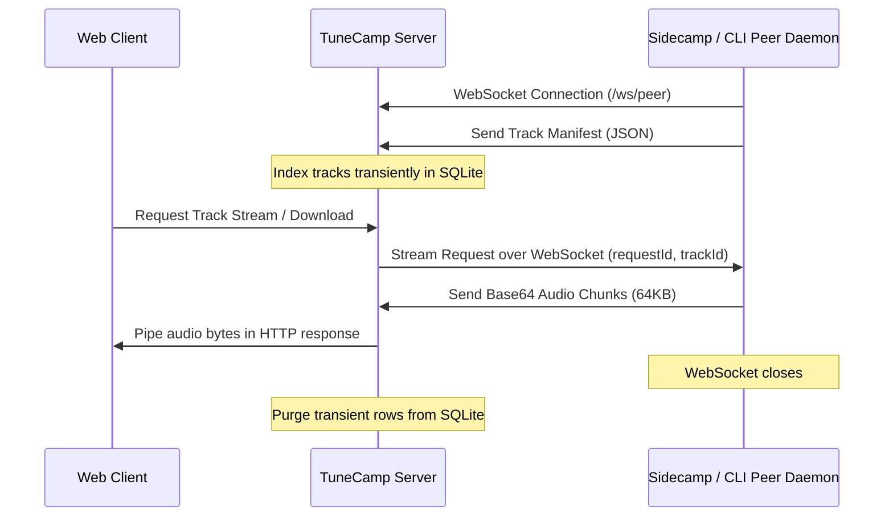

# TuneCamp Sidecamp

**Sidecamp** is an npm-workspaces monorepo hosting the TuneCamp desktop companion ecosystem. It handles all P2P content acquisition and peer file-sharing — keeping the core server clean and fully compliant.

```
apps/sidecamp        # Electron desktop companion app
apps/graphofone      # Standalone live-performance app (no P2P, no server)
apps/sidecamp-cli    # Headless CLI client (no Electron): search/download/upload/peer daemon
packages/audio-engine # Pure Web Audio DSP: crossfade player, time-warp, worklets
packages/graph-ui     # React graph view: track graph, transitions, waveforms, recording
```

Shared dependency: `tunecamp-design-system` — 5-theme picker (dark/light/grey/nordic/nordic-dark), consumed by Sidecamp and Graphofone via npm `file:`/`github:`.

---

## Apps

### Sidecamp (Electron)

The main desktop companion. Connects to a TuneCamp instance via WebSocket and exposes a modern React UI for:

- 🔎 **Unified Search** — Soulseek, SoundCloud, Bandcamp, torrents, Internet Archive, and the TuneCamp peer network from one bar.
- 🧲 **BitTorrent / WebTorrent** — Add magnet links or torrent files; download and seed from your desktop.
- 🎬 **yt-dlp Audio Ripping** — Rip audio from YouTube, SoundCloud, Bandcamp, and other platforms.
- 🌐 **Network Explorer** — Browse tracks shared by TuneCamp peers and the server catalog.
- 🎵 **Local Library** — Browse downloaded files with in-app player; edit ID3 tags; rename files.
- 📂 **Shared Files Browser** — Navigate, create subfolders, move or delete files in your shared folders.
- 💬 **Peer Chat** — Direct messages to other peers, end-to-end encrypted (Curve25519/XSalsa20-Poly1305 via `tweetnacl`). The relay server never sees DM plaintext. The same `ChatService` shared lobby also serves browser webapp tabs connecting via `/ws/chat`.
- 📁 **Peer File Sharing** — Share local music folders via a secure reverse WebSocket tunnel (`/ws/peer`). Listeners stream or download files relayed through the server.
- 📤 **Upload to TuneCamp** — Push tracks from the local library to your TuneCamp account.
- 🖥️ **Desktop GUI** — React + Vite inside Electron, 5 themes via `tunecamp-design-system`.

### Graphofone (Electron)

A focused **live-performance tool** — fully offline, no P2P, no server required. Import a music folder, arrange tracks as a graph, link them with beat-matched crossfade transitions, and perform. Ships with a first-run quick tour (reopen via the `?` button). The graph/mixing engine (`packages/graph-ui`, `packages/audio-engine`) lives in Graphofone only; Sidecamp stays a lean player with classic playlists.

### Sidecamp CLI

Headless terminal client for the same functionality without Electron — for servers, headless boxes, or scripting. Auth via `sidecamp login` (stores JWT in `~/.config/sidecamp-cli/config.json` on Linux/macOS or `%APPDATA%/sidecamp-cli/config.json` on Windows).

**Commands:**

| Command | Description |
|---|---|
| `sidecamp login <server> <username> <password>` | Authenticate and save JWT locally |
| `sidecamp library [query]` / `catalog` | View or search the instance catalog |
| `sidecamp download-track <trackId>` | Download a track from the instance library |
| `sidecamp search -s <source> <query>` | Search a source: `youtube` (default), `soundcloud`, `bandcamp`, `archive`, `torrent`, `soulseek`, `library` |
| `sidecamp get -s <source> <query>` | Search and auto-download the top result |
| `sidecamp upload <filePath>` | Upload a local file to your TuneCamp account |
| `sidecamp share [-f <folders...>] [--no-downloads]` | Start the headless P2P sharing daemon |
| `sidecamp peers` | List peers connected to your instance |
| `sidecamp peer-tracks <sessionId>` | List tracks shared by a connected peer |
| `sidecamp download-peer-track <sessionId> <trackId>` | Download a peer's track |
| `sidecamp community` | List federated community sites |
| `sidecamp federated-catalog <origin>` | View public catalog of a remote instance |
| `sidecamp download-federated-track <origin> <trackId>` | Download a federated track |
| `sidecamp downloads` | List files in the local sidecamp download directory |

Install globally from inside `apps/sidecamp-cli/`:
```bash
npm install -g .
```

Full reference: [`apps/sidecamp-cli/README.md`](https://github.com/scobru/sidecamp/tree/main/apps/sidecamp-cli).

---

## Architecture Overview


```mermaid
sequenceDiagram
    participant Browser as Web Client
    participant Server as TuneCamp Server
    participant Daemon as Sidecamp / CLI Peer Daemon
    
    Daemon->>Server: WebSocket Connection (/ws/peer)
    Daemon->>Server: Send Track Manifest (JSON)
    Note over Server: Index tracks transiently in SQLite
    
    Browser->>Server: Request Track Stream / Download
    Server->>Daemon: Stream Request over WebSocket (requestId, trackId)
    Daemon->>Server: Send Base64 Audio Chunks (64KB)
    Server->>Browser: Pipe audio bytes in HTTP response
    
    Note over Daemon: WebSocket closes
    Note over Server: Purge transient rows from SQLite
```

1. **Control WebSocket Connection**: The peer daemon connects to `/ws/peer` using a JWT authentication token.
2. **Transient Cataloging**: The daemon scans the shared folders and uploads a metadata manifest. The server indexes these tracks in SQLite.
3. **On-Demand Tunneling**: When a listener plays a peer track, the server requests the track from the daemon over WebSocket. The daemon reads the file in 64KB chunks, encodes them in base64, and pushes them back. The server decodes the chunks and pipes them directly to the Express HTTP response stream.
4. **Instant Cleanup**: If the daemon shuts down or disconnects, the heartbeat ping (every 30 seconds) fails or the connection event triggers cleanup, immediately removing the peer's tracks and session from the database.

---

## Admin Configuration

Administrators can control peer sharing via the **Admin Panel**:

1. **Global Toggles** (under **Settings → Customize Modules**):
   - **Enable Sidecamp**: Turns the feature on or off globally.
   - **Allow Peer Downloads**: Allows listeners to download shared tracks (when disabled, only streaming is permitted).
2. **User Permissions** (under **Users**):
   - Toggle **Sidecamp** for individual users. Only users with this flag enabled can establish a WebSocket connection using the daemon.
3. **Active Dashboard** (under **Peer Sessions**):
   - Real-time list of all connected daemons, showing the user account, connection time, last heartbeat, IP address, and total shared tracks.
   - Allows administrators to manually disconnect/kick any active daemon session.

### Importing a Peer Track into the Library

Beyond streaming and one-off downloads, **Root Admins and Managers** can permanently **import** a shared peer track into the local library. The import button (next to download on each peer track) pulls the full file over the tunnel, writes it under `<musicDir>/peer-imports/`, and runs it through the scanner so it becomes a regular local release — surviving after the peer disconnects.

Importing requires downloads to be allowed (globally, for the session, and for the track), since it transfers the full file. The action is exposed at `POST /api/peers/:sessionId/tracks/:trackId/import` and is restricted to Root Admin / Manager roles.

### Federating Peer Tracks Across Instances

When **Federate Peer Tracks** is enabled (Settings → Customize Modules, off by default), an instance advertises its **currently-shared** peer tracks to other federated TuneCamp instances, alongside its published releases. This reuses the existing federation path:

- The tracks are added to the instance's `GET /api/catalog/full` payload under a `peerTracks` array (only when both **Enable Sidecamp** and **Federate Peer Tracks** are on).
- Remote instances pick them up through the same catalog cache they use for releases and show them on the **Network** page (`type: "peer"`).
- Playback streams through a dedicated **public** endpoint, `GET /api/peers/:sessionId/tracks/:trackId/federated-stream`, reachable without a local account but **only** while peer federation is enabled.
- On the Network page, federated peer tracks are tagged with a distinct **PEER** badge to set them apart from permanent releases.

**Cross-instance import.** If the origin instance also allows peer downloads, federated peer tracks are advertised with a `federated-download` URL. A **Root Admin / Manager** on a remote instance can then import the track into their own library via the **import** button on the Network page (or `POST /api/peers/federated-import` with the `downloadUrl`). The remote instance fetches the file over HTTP (SSRF-guarded, size-capped), writes it under `<musicDir>/peer-imports/`, and indexes it like any local upload. When the origin keeps downloads disabled, only streaming is offered.

These entries are ephemeral: they exist only while the peer daemon is connected. Because a catalog advertising peer tracks is revalidated on a short window (~2 minutes, versus ~1 hour for release-only catalogs), a disconnected peer drops from remote Network pages within a couple of minutes; attempting to play a track that has since gone offline simply returns an error.

**Cross-instance search.** Beyond the passive catalog piggyback above, a logged-in user's **global search** actively fans out to known federated instances (bounded to 10, parallel, 3s timeout, SSRF-guarded) and merges their connected peers' matching tracks, each tagged with its `origin`. This is exposed publicly as `GET /api/peers/federated-search?q=...`, gated behind the same **Federate Peer Tracks** opt-in as `federated-stream`, and is **single hop only** — instance A does not proxy instance B's federation. Remote hits stream from the origin instance's public `federated-stream` endpoint; search and stream only, no download.

---

## Installation & Build

### Prerequisites

- **Node.js** 18+ and **npm**
- **yt-dlp** — auto-downloaded on first rip (no manual install needed)
- A running **TuneCamp** instance (Sidecamp and CLI only; Graphofone is fully offline)

### Development

```bash
git clone https://github.com/scobru/sidecamp.git
cd sidecamp
npm install

# Run in dev mode (Vite + Electron)
npm run dev --workspace apps/sidecamp
npm run dev --workspace apps/graphofone
```

### Production Build

```bash
# From the repo root — builds every app for the current host OS
npm run build

# Or a single app
npm run build --workspace apps/graphofone
```

Per-platform scripts (from inside `apps/sidecamp` or `apps/graphofone`):

```bash
npm run build:win     # NSIS installer (.exe)
npm run build:mac     # DMG (.dmg) + ZIP (.zip)  — macOS host only
npm run build:linux   # AppImage (.AppImage) + Debian (.deb)
```

> **You can't build the macOS installer on Windows or Linux** — it requires Apple tooling. Use CI to produce all three platforms at once.

### Cross-platform CI

`.github/workflows/release.yml` builds **both Sidecamp and Graphofone** on Windows, macOS, and Linux runners in parallel. Push a version tag to publish a GitHub Release with every installer attached:

```bash
git tag v0.1.0 && git push origin v0.1.0
```

Or trigger `workflow_dispatch` manually to build and upload artifacts. CI builds are unsigned (no signing certificates configured).

---

## Connecting to TuneCamp (Electron)

1. Open Sidecamp and go to **Settings**.
2. Enter your TuneCamp instance URL (e.g. `https://your-server.com`).
3. Paste your JWT authentication token (obtainable from TuneCamp's admin panel or API).
4. Select the local directories you want to share.
5. Click **Connect** — Sidecamp establishes a reverse WebSocket tunnel to the server.
